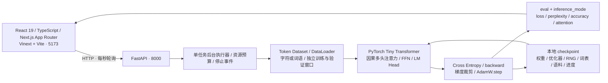

# Transformer Training Lab｜Transformer 训练与可视化实验平台

从 Transformer 计算可视化扩展而来的深度学习训练项目。保留原有中文教学站点，新增 **PyTorch 字符级 / 词级语言模型 + FastAPI 训练服务**：手写训练主循环，使用真实文本和反向传播，在 CPU 或 CUDA GPU 上训练，展示留出验证指标、因果注意力，保存、恢复自己的模型，并逐词生成、查看实时候选概率。不依赖大型预训练模型或 Hugging Face Trainer。

| 入口 | 功能 |
| --- | --- |
| `/training` | CPU / GPU 训练、字符 / 词级模式、指标、checkpoint、续写与逐词候选概率 |
| `/` | 原有 11 步双向 Encoder 计算可视化 |
| `/generation` | 原有因果 Decoder、采样与 KV Cache 教学 |
| `/training/guide` | 原浏览器训练、SFT 与有限候选 RLHF 课程 |
| `/training/grokking` | 原有泛化概率回放，明确不执行真实训练 |
| `/build-model` | 原有浏览器端从零造模、SFT 与实验文件课程 |

## 生成更通顺的英文句子

训练页点击 **“应用英文句子实验配置”**，再开始真实训练：使用随仓库提供的
1,901 篇 TinyStories 简单英文短故事（约 155 万字符），4 layers / 4 heads /
hidden 128 / context 64 / batch 16 / lr 0.001 / 2,000 steps / eval interval 100。
推荐 CUDA；CPU 达到 180 秒单次预算后自动保存，可加载后继续训练。
训练完成后，提示自动设为 `Once upon a time`、temperature 0.7、Top-k 10。
“生成长度”可选择 **一句话**，模型实际生成 `.?!` 后停止，最多仍为所设词元数；
也可按词元上限续写。逐词与自动生成始终按真实模型概率推进，不受一句话开关影响。

TinyStories 是研究者公开的**合成文本数据集**，不是人为编写的输出模板。
本项目仍从随机权重开始训练，未加载预训练权重。数据出处、许可和改动说明见
`backend/data/README.md` 与 `tiny_stories.provenance.json`。
自动生成速度可运行中调整；等待间隔从上一次请求结束开始计算，实际速度还包含推理耗时。
暂停会取消待发定时器；已发出的单次推理可能完成，但不会继续排队。

## 架构与技术栈

### 简单自我介绍与创造者

想同时保留英文续写并问“你是谁”，使用 **“应用续写与自我介绍配置”** 后训练。
模型从随机权重学习 TinyStories 与 `backend/data/self_introduction.json` 中
24 条中英文示范问答；创造者名称按项目所有者要求设为 **狗头人**。
这是故事与少量身份问答的混合训练，未做独立的 assistant-only loss 微调。
完成后可点击“问问模型：你是谁？”或“问问模型：创造者是谁？”，输入框也可输入
这些范围内的简单问题。问答采用 Top-k 1，稳定选择模型概率最高的下一词；
仍可以逐词查看原始概率或自动生成，速度选择照常可用。
界面负责添加训练时使用的对话格式；后端只执行 Transformer 推理，未按问题查表。

```text
python -m backend.benchmark --device cuda --size medium --tokenizer word --dataset stories_identity --learning-rate 0.001 --eval-interval 100 --steps 2000 --storage backend/runs --output experiments/my-identity.json
```

实测记录 `experiments/cuda-stories-identity.json`：1,854,208 参数、2,000 步、
约 **30.49 秒**；验证 loss **3.0558**、perplexity **21.24**、词元准确率 **40.11%**，
峰值张量显存 **138.9 MiB**。混合语料约 166 万字符；验证评估 40,192 个目标词元。
同设备 checkpoint 恢复后生成一致。真实生成的五个固定提示结果：

| 问题 | 模型生成回答 |
| --- | --- |
| Who are you? | I am a small language model trained in Transformer Training Lab. |
| Who created you? | My creator is狗头人. |
| 你是谁？ | 我是 Transformer Training Lab里的小型语言模型。 |
| 你的创造者是谁？ | 我的创造者叫做狗头人。 |
| 你好 | 你好，我可以续写简单英文故事。 |

这里的身份问答在训练中见过，重复样本也存在于混合语料的验证段。
这证明模型学会了小范围回答，**不证明通用问答能力或新问题泛化**。
混合验证 perplexity 包含容易重复的身份样本，不宜直接和纯故事实验比较。
未训练的中文问题仍可能有未知词或答错；英文长故事也仍可能不连贯。



训练模型为 Decoder-only、Pre-LN：字符 Embedding + 可学习位置 Embedding → 多层因果多头注意力（显式 Q/K/V）→ 残差 → GELU FFN（4× hidden size）→ 残差 → 最后 LayerNorm + LM Head。默认 2 layers、4 heads、hidden size 64、context 32，内置语料上有 109,884 个可训练参数。

Python 服务独立运行。单 worker 在后台训练，API 读取进度无需等待任务完成。训练期间保存、加载、推理和新建任务返回 409，避免共享权重竞态。最多保留 8 个任务的内存状态；checkpoint 持久化到磁盘，服务重启后可恢复。前端刷新后自动重新发现运行任务。教学页面与 PyTorch 服务分别管理权重。

## 真实训练流程

1. 加载仓库内 Tiny Shakespeare 前 50,000 字符，或用户提供的真实文本。
2. 按文本顺序划分互不相交的训练/验证区域，只从训练部分建立词表。字符模式保留每个 Unicode 字符；词级模式用正则切英文完整词语、数字与标点，用 Jieba 0.42.1 精确模式（HMM 关闭）切中文。词级边界调整到完整词元。验证未知词元映射到 `<unk>` 并报告数量。
3. `TokenDataset` 返回输入序列和向后偏移一位的标签，窗口不跨划分边界。`DataLoader` 按 epoch 使用固定种子打乱训练窗口。
4. 初始化 PyTorch 模型与 AdamW。每批执行 `model.train()` → `zero_grad()` → `forward()` → `cross_entropy()` → `loss.backward()` → 梯度范数裁剪到 1 → `optimizer.step()`。
5. 在 step 0、评估间隔和结束时执行 `model.eval()` 与 `torch.inference_mode()`。Train loss 使用固定前 8 批训练窗口；Validation loss 使用完整验证窗口，按目标词元数加权。Perplexity = exp(validation loss)，accuracy 为验证词元 top-1 准确率。字符与词级 perplexity 的单位不同，不能直接比较大小。
6. 达到 steps、可选 epoch 上限、用户停止或时间预算后保存完整 checkpoint。停止在批次边界生效，最终评估和写入可能额外花少量时间。
7. 恢复模型、AdamW、RNG 与批次游标。继续训练使用累计目标 steps；分 epoch 的确定性打乱支持精确延续。
8. 推理固定权重，用 temperature + Top-k 自回归采样，上下文滚动截取到模型 context。训练评估展示验证窗口的 Layer 1 / Head 1；推理可选择层和头查看真实注意力，最多展示 32 个词元。
9. 逐次预测：当前上下文 `forward` → 下一位置 logits → Softmax 候选概率；点击“下一词”只采样一个词元，再对更新后的上下文执行 `forward`。返回整个词表的原始概率与经过 temperature / Top-k 处理的采样概率。候选可搜索或展开；保留精确词元列表作为历史，中文拼接后不会重新分词改变已生成的词元。

核心实现：`backend/model.py`、`backend/data.py`、`backend/training.py`。没有 Trainer 封装或模拟训练曲线。

## 本地运行

需要 Python 3.12（实测版本）、Node.js 22.13+（推荐 24）和 npm。以下命令在仓库根目录执行。

终端一，安装并启动 CPU 训练服务：

```powershell
python -m venv .venv
# Windows PowerShell
.venv\Scripts\Activate.ps1
# macOS / Linux: source .venv/bin/activate
python -m pip install torch==2.13.0 --index-url https://download.pytorch.org/whl/cpu
python -m pip install -r backend/requirements.txt
python -m uvicorn backend.app:app --host 127.0.0.1 --port 8000
```

存档默认写入 `backend/runs/`（已忽略 Git）；可设置 `TRAINING_STORAGE_DIR` 改变目录。交互式接口文档：`http://127.0.0.1:8000/docs`。

NVIDIA GPU 版（本次在 RTX 4060 Laptop 8 GB、驱动 610.74 上验证）：使用 CUDA 13.0 版 PyTorch。Windows 下用较短的环境路径，避免 wheel 的第三方许可证目录触发长路径错误。在新终端执行：

```powershell
$gpuEnvPath = Join-Path $env:LOCALAPPDATA 'tlab-gpu'
python -m venv $gpuEnvPath
& "$gpuEnvPath\Scripts\python.exe" -m pip install -r backend/requirements-cuda.txt
& "$gpuEnvPath\Scripts\python.exe" -m uvicorn backend.app:app --host 127.0.0.1 --port 8000
```

CPU / GPU 服务二选一运行在 8000 端口。其他平台可在虚拟环境中安装 `backend/requirements-cuda.txt`，驱动与平台需支持对应 CUDA wheel。界面选择“自动选择”优先 CUDA，无法使用 CUDA 时自动用 CPU；显式选择 CUDA 时不可用会报错。存档可在 CPU 与 CUDA 之间加载，固定 seed 的采样和数值不保证跨设备完全相同。

终端二，运行前端：

```text
npm run install:ci
npm run dev
```

打开 [http://localhost:5173/training](http://localhost:5173/training)，默认连接 `http://127.0.0.1:8000`。开始训练，完成后输入 `First Citizen:` 续写，再保存、加载或继续训练。原教学页面无需 Python 服务也能使用；未连接服务时，训练页说明原因，不显示模拟指标。

前端默认**词级**模式。训练完后点击“查看下一词候选”，再连续点击“下一词”；每次增加一个真实模型词元，概率随上下文更新。“开启自动下一词”会在每次响应后等待所选间隔继续生成（快 0.5–1 秒、标准 3–5 秒、慢 6–10 秒、自定义 0.3–30 秒），可随时暂停；切换模型、修改提示或采样设置、发生接口错误会自动暂停，避免请求重叠。词元包括词语、数字和标点；Top-k 设为 0 可查看完整采样分布。旧字符 checkpoint 仍逐字符生成，要逐词生成需选择词级模式重新训练。中文训练请提供自己的中文语料，英文莎士比亚词表不能生成未学习的中文词语。

`npm run build` 后可用 `npm start` 运行生产构建。受限环境安装依赖后也可执行 `node scripts/run-framework.mjs dev` / `build`。

## API 与资源限制

| 方法 | 路径 | 作用 |
| --- | --- | --- |
| GET | `/health`, `/tasks`, `/tasks/{id}` | CPU / CUDA 能力、任务列表、训练状态与指标 |
| POST | `/tasks` | 创建任务，body 为 `{ "config": {...}, "text": "可选语料" }` |
| POST | `/tasks/{id}/stop` | 停止并自动保存 |
| POST | `/tasks/{id}/resume` | 继续训练，body 如 `{ "max_steps": 400 }`，表示累计目标 |
| POST | `/tasks/{id}/checkpoint` | 手动保存完整 checkpoint |
| GET | `/checkpoints`, `/checkpoints/{id}/download` | 持久存档列表、下载 `.pt` |
| POST | `/checkpoints/{id}/load` | 恢复任务，可发送 `{ "device": "cpu" }` / `"cuda"` / `"auto"` |
| POST | `/tasks/{id}/generate` | prompt、temperature、max_new_tokens、top_k、seed、layer、head、stop_after_sentence |
| POST | `/tasks/{id}/predict` | prompt 或精确 context_tokens，返回下一词元全部候选及概率 |
| POST | `/tasks/{id}/step` | 采样一个词元，返回 next_token、抽样概率与更新后的预测分布 |

- CPU 固定 2 线程；只接受一个活跃训练任务，不堆积队列。
- GPU 限制 PyTorch 分配器到显卡容量的 25% 且最多 2 GiB；这是张量分配预算，CUDA 上下文、驱动和其他程序的显存不计入。任务展示峰值已分配张量显存。显存不足明确提示减小模型、batch 或上下文。
- 1–4 layers、1–8 heads、hidden size 16–128、context 8–128、batch 1–32、1–2000 steps；hidden size 须整除 heads。
- 分配模型前检查最多 300 万参数、注意力矩阵元素与单步计算预算；非法组合返回 422。
- 每次运行最多 180 秒，训练和评估均检查 stop 事件；继续训练重新获得单次预算。
- 最多 20 个 checkpoint、总存储预算 200 MB；超限明确报错，停止服务后清理 `backend/runs/`。下载不会移除服务端原存档。
- 语料 256–2,000,000 字符。字符模式最多 255 个不同训练字符；词级保留训练集频率最高的 4095 项，低频词映射到 `<unk>`，仍受 300 万参数限制。单词元最多 512 字符。批量推理最多生成 128 词元，提示最多 512 字符；逐次生成每次一个词元，历史上下文最多 128 词元，页面仅保留最近 16,000 字符。
- 未知提示字符、非法层/头、缺失任务、损坏存档、非有限 loss 均有明确错误。
- checkpoint 使用临时文件和原子替换；只加载服务生成的 UUID 文件，采用 `torch.load(weights_only=True)`，不接受任意路径或外部上传。
- 默认只绑定 loopback，CORS 仅允许 `localhost:5173` / `127.0.0.1:5173`。这是本地单用户实验服务。公开部署需认证、隔离训练 worker 和配额。Cloudflare Workers 无法运行 PyTorch；需独立部署 Python 服务，并配置 HTTPS 地址和 `TRAINING_ALLOWED_ORIGINS`。本次保持原托管身份。

## 自动化检查

```text
python -m pytest backend/tests -q
npm run check:types
npm run check:training-api
npm run check:model
npm run check:generation
npm run check:training
npm run check:grokking
npm run check:journey
npm run build
```

后端覆盖任务创建、真实参数更新、验证指标、因果遮罩、checkpoint 保存/恢复/服务重启、推理一致性、CPU / GPU 上 AdamW 与批次游标精确恢复、GPU 存档加载到 CPU、并发拒绝、停止、资源超限、损坏存档和 CORS。词级测试覆盖中文 / 英文分词、候选概率和实际 logits 一致、概率归一化、Top-k 1、逐词上下文更新和恢复后候选一致。没有 CUDA 时两项 GPU 测试跳过；本机 GPU 环境实测全部 16 项通过，另覆盖大语料词表频率截断、数据集选择和模型实际预测句末后停止。Jieba 的旧 pkg_resources 调用在当前 Anaconda 环境有弃用警告，不影响测试。前端 API 检查覆盖设备 / 词元请求、错误反馈与生命周期；原有全部数值验证保留。GitHub Actions 分别运行 Python 和前端检查。

## 可复现实验与简历亮点 / 可量化实验结果

从头复现本次 CPU 基线：

```text
python -m backend.benchmark --steps 200 --output experiments/my-cpu-baseline.json
```

真实记录为 `experiments/cpu-baseline.json`：包含逐次指标、配置、语料 SHA-256、环境、生成文本及 checkpoint 恢复一致性。语料出处与快照边界见 `backend/data/README.md`。

实测日期 2026-10-10。Windows 11、AMD Ryzen 9 7845HX、Python 3.12.4、PyTorch 2.13.0+cpu、CPU 2 线程。seed 42，2 layers / 4 heads / hidden 64 / context 32 / batch 16 / lr 0.003 / 200 steps。训练 45,000 字符、验证 5,000 字符，词表含 `<unk>` 共 60 项，验证未知字符为 0。

| 指标 | 初始化 step 0 | 训练后 step 200 |
| --- | ---: | ---: |
| 固定训练子集 loss | 4.3235 | 2.2439 |
| 完整验证窗口 loss | 4.3159 | 2.2838 |
| 验证 perplexity | 74.88 | 9.81 |
| 验证字符准确率 | 0.78% | 33.99% |

- **109,884 参数**，200 steps 约 **2.27 epochs**。
- 模型初始化、训练与评估耗时 **3.54 秒**；包含 checkpoint 写入和任务轮询的墙钟时间 **3.59 秒**。生成和存档恢复验证不计入这两项。
- 每个 train loss 点评估固定 4,096 个目标字符；完整验证窗口评估 4,992 个目标字符，末尾不足窗口的部分不参与评分。
- 保存并重新加载后，固定提示、seed 和采样参数的生成完全一致；测试验证恢复后继续训练与不中断训练的最终权重逐张量相同。

可据实写入简历：**“基于 PyTorch 与 FastAPI 实现 Transformer 训练与可视化实验平台，手写字符级因果 Transformer 和训练主循环；提供异步任务管理、留出验证、注意力热力图、checkpoint 精确恢复和自回归推理。在 5 万字符 Tiny Shakespeare 子集上训练 10.99 万参数模型，200 步将验证 perplexity 从 74.88 降至 9.81。”**

这是单 seed、小语料实验；时间依赖本机性能，不代表通用语言能力、生产吞吐或多次平均结果。后续可增加独立测试集、多 seed 重复、消融实验、更多中英文语料、BPE 处理未登录词、GPU 混合精度、训练进程隔离、持久任务管理、可取消推理、学习率调度与 TensorBoard。

参考：[PyTorch 数据加载](https://docs.pytorch.org/docs/stable/data.html)、[模型保存与恢复](https://docs.pytorch.org/tutorials/beginner/saving_loading_models.html)、[FastAPI CORS](https://fastapi.tiangolo.com/tutorial/cors/)、[Jieba 分词](https://github.com/fxsjy/jieba)。

## 英文故事实验（实际运行）

```text
python -m backend.benchmark --device cuda --size medium --tokenizer word --dataset stories --learning-rate 0.001 --eval-interval 100 --steps 2000 --storage backend/runs --output experiments/my-stories.json
```

本机 RTX 4060 Laptop / PyTorch 2.13.0+cu130 / seed 42 实测，详见
`experiments/cuda-stories.json`。`--storage backend/runs` 将真实 checkpoint 保留在
服务默认目录，前端刷新存档列表后即可加载。命令省略 `--storage` 时使用临时存储。

| 指标 | step 0 | step 2,000 |
| --- | ---: | ---: |
| 固定训练子集 loss | 8.4929 | 2.3206 |
| 完整验证窗口 loss | 8.4938 | 3.3058 |
| 词级验证 perplexity | 4884.49 | 27.27 |
| 词元准确率 | 0.057% | 36.01% |

模型 **1,854,208 参数**，约 6.15 epochs；训练与评估 **24.97 秒**，峰值张量显存
**139.7 MiB**。词表含 `<unk>` 共 4,096 项；完整验证评估 36,928 个目标词元，
验证中 562 个未知词元计入 loss。checkpoint 恢复后同设备、同提示与 seed 的生成完全一致。
随机初始化、相同代码完成全流程；无句子修补、规则模板或外部大模型代答。

固定 seed 42 / temperature 0.7 / Top-k 10 的四个提示，实际生成的第一句：

| 提示 | 实际输出首句 |
| --- | --- |
| Once upon a time | Once upon a time, there was a boy named Tim. |
| One day | One day, Tom saw a big bottle of the tree. |
| The little girl | The little girl was happy to see the clean violin. |
| The dog | The dog was happy to have such a lot of friends. |

所有四个完整 100 词元输出均保存在实验 JSON，未筛掉不理想的样本。现在能学出简单
句式，但“a big bottle of the tree”等搭配仍不自然，长文还会出现角色变化、重复和
逻辑跳跃。perplexity 衡量该词表/语料上的预测，不能直接和莎士比亚或字符级实验比较，
也不等于人类语法评分。本次只运行一个 seed，没有通用语言能力保证。
下一步质量提升可增加故事数据、独立故事级划分/测试集、更长上下文、子词分词和
正则化，并报告多 seed 验证与固定提示生成评测。

## GPU 对比与词级实验（实测）

CPU / CUDA 对比使用同一个 PyTorch **2.13.0+cu130** 环境、相同训练代码、语料、seed 42、lr 0.003、batch 16、评估间隔 20 和 200 steps；CPU 限 2 线程，GPU 为 RTX 4060 Laptop 8 GB。每个配置分别运行一次，按顺序运行，未做多次均值。时间包含 worker 内模型 / AdamW 初始化、训练、验证，排除 Python 导入、设备发现、checkpoint 写入与生成。

| 配置 | 参数数 | CPU 耗时 | GPU 耗时 | 本次加速比 | GPU 峰值张量显存 |
| --- | ---: | ---: | ---: | ---: | ---: |
| 字符 · 2L / 64D / context 32 | 109,884 | 3.27 s | 3.22 s | 1.02× | 22.9 MiB |
| 字符 · 4L / 128D / context 64 | 816,956 | 13.98 s | 4.33 s | 3.23× | 65.8 MiB |
| 词级 · 2L / 64D / context 32 | 382,074 | 4.80 s | 3.30 s | 1.45× | 42.4 MiB |

记录：`experiments/cpu-comparison-{tiny,medium,word}.json` 与 `experiments/cuda-{baseline,medium,word-baseline}.json`。这些显存值只统计 PyTorch 的峰值已分配张量，**不等于整个进程或显卡的总占用**。很小的模型受初始化、调度和数据传输开销影响，GPU 并不总能明显提速；本次中等模型的收益更大。平台 300 万参数上限是交互式实验预算，不是 8 GB 显卡的硬件训练上限。

同一 GPU 环境复现（把 `python` 换为该环境的 Python 路径）：

```text
python -m backend.benchmark --device cpu --size medium --steps 200 --output experiments/my-cpu-medium.json
python -m backend.benchmark --device cuda --size medium --steps 200 --output experiments/my-cuda-medium.json
python -m backend.benchmark --device cuda --tokenizer word --steps 200 --output experiments/my-word.json
```

词级语料按完整词元边界得到 45,004 / 4,996 字符、10,181 / 1,069 词元，词表含 `<unk>` 共 2,170 项。200 steps 约 10 epochs，完整验证窗口含 1,056 个目标词元。GPU 词级实验的实测指标：

| 指标 | step 0 | step 200 |
| --- | ---: | ---: |
| 固定训练子集 loss | 7.8703 | 2.4894 |
| 验证 loss | 7.8244 | 6.9933 |
| 词级验证 perplexity | 2500.85 | 1089.33 |
| 词元准确率 | 0.00% | 5.87% |

候选概率由训练权重实时计算；本次页面验证中，从 `First Citizen:` 开始，连续两次点击分别生成完整词元 `I`、`would`，下一词候选随上下文更新。这展示训练与逐词预测链路，**不代表模型已具备高质量语言能力**：该小语料词级模型训练 / 验证 loss 差距明显，存在过拟合，验证部分还有 147 个未登录词元。增加语料、独立测试集、子词分词和多 seed 实验是后续提升重点。

GPU 字符中等模型在 200 steps 后验证 loss 为 **2.1044**、perplexity **8.20**、字符准确率 **38.54%**。所有实验都验证了同设备 checkpoint 恢复后的固定 seed 生成一致性。测试另外覆盖 CPU / CUDA 的精确继续训练和 GPU 存档加载到 CPU。

## 原有教学模块（完整保留）

下面描述浏览器教学模块；原 `/training` 课程已迁至 `/training/guide`。它们与 Python checkpoint 分别管理权重。


## 已实现

- 输入、简化分词、Embedding、正弦位置编码、Q/K/V、缩放点积、Softmax 与 AV、多头拼接与投影、Add & Norm、FFN、第二次 Add & Norm 与输出表示。
- 上一步、下一步、自动播放、暂停、速度切换、重置、直接跳转。
- token 查询切换、2 个注意力头对比、动态连线、热力图、数值提示、权重条形图。
- 中文说明、公式、实时张量维度、键盘操作、手机布局与减少动态效果支持。
- 空输入提示，最多计算前 10 个 token，并明确提示截断；最多输入 240 个字符。

## 教学约定

本项目使用固定随机种子的演示参数，**未经过训练**。数值计算真实、可复现，但不代表已经学到的语义关系。

- 空格分词；无空格中文按字拆分，拉丁字母连续串作为一个 token。不是 BPE。
- token ID 来自当前句子的临时词表；重复 token 共享 ID 和嵌入。
- `d_model=8`、`heads=2`、`d_k=d_v=4`、`d_ff=16`、`batch=1`。
- 正弦位置编码；后置 LayerNorm；ReLU FFN；两次残差与归一化。
- γ=1、β=0、ε=1e-5；省略 dropout、嵌入缩放和 batch 维展示。
- Encoder 可以查看前后所有 token。没有因果遮罩；不是 GPT Decoder。
- 最后输出上下文向量，不生成下一词。
- 输入只用于浏览器内计算，不发送给模型服务。

结构依据：[Attention Is All You Need](https://arxiv.org/abs/1706.03762)。

## 结构与扩展

```text
app/page.tsx                         页面状态、播放控制、交互编排
app/globals.css                      设计变量、响应式样式和动画
components/lab/visualization.tsx     SVG 连线、向量、矩阵、逐阶段可视化
lib/transformer/engine.ts            无 UI 依赖的确定性计算引擎
lib/transformer/steps.ts             中文课程、公式和维度元数据
lib/modules.ts                      模块注册表（LoRA / RAG / KV Cache 扩展点）
scripts/verify-model.mjs             数值和边界验证
```

后续模块可各自建立 `lib/<module>/engine.ts` 与 `steps.ts`，复用播放控制与可视化组件。LoRA、RAG 尚未实现。LLM 生成模式及 KV Cache 已实现，入口为 `/generation`，首页顶部与“输出表示”之后均有入口。

## 检查结果

已通过 TypeScript 检查与生产构建；覆盖 6 类输入的数值不变量检查，包括 Softmax 稳定性、每行权重和、归一化、位置区分、上下文敏感性与截断。浏览器验证包括 11 个步骤、输入边界、头与 token 切换、播放终点、键盘、对话框、桌面/390px 手机布局与减少动态效果；未发现页面脚本异常。

WebMCP 渐进增强工具 `navigate_transformer_step` 已通过模拟注册接口的有效/无效输入检查。当前浏览器无原生 WebMCP，因此未验证原生浏览器集成，不影响正常交互。

## 发布

本项目可通过 Sites 发布；`.openai/hosting.json` 保存站点身份，不包含密钥。开发预览的本地模拟登录来自 Sites starter，生产发布不使用模拟登录。


## LLM 生成模式（/generation）

独立于双向 Encoder 的单层因果 Decoder。生成过程为：因果层内计算 → 最后一个 hidden state → LM Head → logits → 温度与 Softmax → 候选筛选 → 选出 token → 追加上下文 → 下一轮。

- 固定的 24 项教学词表（含 EOS），真实矩阵乘法得到 logits；不是预写答案或连接在线模型。
- 采样支持 Greedy、Top-k、Top-p 和全词表 Temperature。温度先作用于 logits；过滤后再归一化。Greedy 忽略温度。
- 默认固定种子，输入/参数相同可复现。更改采样参数会重开实验；后退与前进回放同一个采样结果。
- “自动播放本轮”追加一个 token 后暂停；“连续生成”自动进入下一轮，直到 EOS 或上限。都可以随时暂停。
- 起始提示 1–12 个 token，最多新生成 12 个，上下文不超过 24；过长提示明确报错，不静默截断。
- KV Cache 是实际增量计算：首次 Prefill 计算提示的全部 K/V；后续轮只投影新增 token。开关缓存保留教学进度与已生成结果，并重建对应计算轨迹。
- 因果遮罩矩阵展示全部行；最后一行注意力重点高亮，未来 token 单独标注为不可见。
- 缓存之外保留的 hidden state 与旧注意力行仅供教学复盘。计数对比表示算法操作次数，不声称是真实延迟或内存测量。

新增源码：

```text
app/generation/page.tsx              生成模式路由与元数据
components/lab/generation-lab.tsx    生成流程、图表、缓存对照、采样控制
lib/generation/engine.ts             因果 Decoder、增量 KV、LM Head、采样
lib/generation/session.ts            可回退的生成帧、停止条件与缓存切换
lib/generation/steps.ts              生成教学步骤与公式
scripts/verify-generation.mjs        因果不变性、缓存等价性、采样与回退验证
```

数值测试覆盖 6 轮完整/增量推理的 hidden state、attention 与 logits 等价；改变未来 token 不影响前文表示；400 次种子采样均只落在保留候选中；包括 top-p 最短前缀、温度、EOS、上限、上下文回退与缓存切换。浏览器检查覆盖全部 8 步、四种策略、单轮播放与连续生成、输入边界、桌面与手机、原 Encoder 入口。

参考：[生成策略](https://huggingface.co/docs/transformers/main/en/generation_strategies)、[KV Cache](https://huggingface.co/docs/transformers/main/en/kv_cache)。

## 模型训练实验室（/training/guide）

新模块与 Encoder、LLM 生成模式共用导航和设计。全部句子与对话均为预设，无需用户输入、模型 API 或服务器训练。

- 7 章：训练材料、随机初始化、一次参数更新、训练与 checkpoint、SFT、RLHF、训练与生成对照。
- 字符级固定词表与从语料生成的真实前缀/目标；微型因果 Transformer 使用交叉熵、完整反向传播与 Adam，在浏览器实际更新共享参数。
- 手动拆解预测、loss、梯度、优化器更新与更新后的检查；自动循环最多 2400 步；曲线使用固定训练集的实际平均 loss。
- 每 400 步保存深拷贝权重，历史查看不覆盖当前状态。数据和权重仅保存在页面会话中，刷新重置。
- 训练后的真实续写与初始化权重对比共用模型结构；SFT 回复对比仍为清楚标注的预设教学样例，不运行 token 级微调，也不伪造 loss 数字。
- RLHF 收集真实点击偏好，训练四个人工教学特征上的线性奖励模型；在四个候选上实际优化期望奖励减 KL。不是完整 PPO。用户可撤销标注，也可比较准确性与奉承评分规则。
- temperature 只属于原有生成模块，不参与训练参数更新；普通生成不触发反向传播。

数值验证：`npm run check:training`。验证目标对齐、有限差分梯度、单样本更新、2400 步训练、checkpoint 拷贝、相反偏好产生相反评分及 KL 策略优化。

新增实现：`lib/training/engine.ts`、`components/lab/training-lab.tsx`、`app/training/page.tsx`、`app/training/training.css`、`scripts/verify-training.mjs`。

## 泛化专题（/training/grokking）

从模型训练模块的「泛化专题」入口进入。以 49 道模 7 加法题为材料，固定划分 21 道训练题与 28 道验证题。

- 教学概率回放，不执行神经网络训练；27 个预设存档，step 仅为教学刻度。
- 训练与验证 loss 均由每道题目标答案的概率计算，准确率由最大概率预测计算；曲线、方格、概率条、同题存档共享相同数据。
- 自动回放在训练题满分之后暂停，先考一道新题，再继续体验较晚的验证表现改善；提供暂停、重置、存档滑块、预设节点与回放速度。
- 同一问题可以固定观察，也能同屏比较六个存档；切换「较晚泛化」「只背答案」保持当前存档和题目。
- 独立十位数样例比较 exact-match 和逐位准确率，说明评分门槛造成的突变外观；不宣称所有涌现都是测量假象。
- 手机布局、键盘操作与减少动态效果；状态仅保存在页面会话。

验证：`npm run check:grokking`。检查题目划分、49 题 × 27 存档 × 两条轨迹的概率归一化与指标一致性、延迟泛化反差、固定新题前后答案、回放暂停门槛与两种评分。

主要源码：`lib/training/grokking.ts`、`components/lab/grokking-lab.tsx`、`app/training/grokking/page.tsx`、`app/training/grokking/grokking.css`。

### Trainable Transformer connection

The first four chapters at `/training` now train a real one-layer, one-head causal Transformer: character and learned position embeddings; pre-LayerNorm attention with Q/K/V and output projection; residual connections; an 8→16→8 ReLU feed-forward network; final LayerNorm and vocabulary projection. All 1,273 parameters are shared across prefixes and updated by full analytic backpropagation and Adam (global gradient norm clipping at 1; default learning rate 0.003). Each teaching update uses the last position's next-character target.

Intermediate activations, masked attention, parameter-group gradients, actual deltas, full weight/optimizer snapshots and greedy autoregressive output all come from the same model. Inference never changes the weights. Numerical checks validate every parameter gradient against finite differences, causal invariance, deterministic initialization/training, checkpoint independence and a real training-loss reduction. This tiny corpus is a training demonstration, not a claim of held-out generalization. SFT, finite-candidate RLHF and grokking remain clearly labeled separate teaching modules; the original Encoder and generation demonstrations retain their independent fixed example weights.

## 从零造模工作台（/build-model）

十二步连续项目：命名与目标、组合预设语料、清洗、整句划分、分词、动态模型结构、分步/自动预训练、验证诊断、实际 assistant-only SFT、独立的有限候选偏好实验、留出测试、模型卡与实验文件导入导出。所有文本与测试提示均预设，仅名字允许自由输入。

- 复用实际可训练因果 Transformer，增加 8/12/16 维及 16/24 token 上下文配置；默认结构保持原训练页兼容。
- 数据选择、去重、空白处理和乱码过滤影响实际训练材料；整句及其所有重复版本只属于同一数据集合。
- 字符词表固定公开，另可从训练集频次建立最多八个双字合并；明确不是完整 BPE。训练集、验证集、测试集指标来自真实预测。
- 默认预训练最多 1,600 步；SFT 继续同一权重和 Adam 状态，只有示范回答 token 提供目标，最多 800 步。曲线允许真实过拟合和遗忘；不捏造智能或泛化成功。
- 偏好环节训练独立线性评分器和四候选概率策略，明确不执行完整 PPO，也不更新 Transformer。新增/撤销标注会重置附加策略。
- 模型权重、Adam 状态、初始化与历史存档、配置、词表、选择、日志和源码随 JSON 实验文件导出；经结构/数值检查后可导入并保持相同后续训练行为。测试报告导入时重算。页面状态临时，必须下载实验文件才能在刷新后恢复；不声称跨设备自动同步。
- `scripts/generate-journey-source.mjs` 从真正运行的四份源码生成显示内容。片段标记只指导显示，教学暂停发生在函数调用之间；不是浏览器调试器。生产构建重新生成源码视图，避免展示代码与执行代码脱节。

验证：`npm run check:journey` 覆盖划分泄漏、清洗和分词、六种维度/分词配置的梯度与训练、真实 SFT、独立偏好策略、留出评测、显示源码一致性以及完整导入后相同的继续训练。

从零造模的修复流程：第 8 步可预览并恢复检查点，连同 Adam 状态和阶段计数恢复，恢复前保留权重备份并让旧验收报告失效。第 9 步支持 0/25/50% 原训练文本混入 SFT，以及预训练学习率的 15/35/70% 微调学习率。第 8 步比较预训练检查点和当前权重的留出续写、已训练示范问答、未训练改写问答；后者只用于评测。问题提示依据实际分数和数据覆盖，链接到对应检查步骤；阈值只是教学线索。旧版 JSON 实验档案仍可导入，导入时补齐旧检查点的阶段计数。
